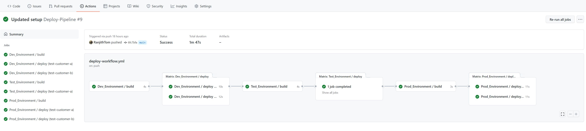

# github-reusable-workflow

## Sample Github action workflow

1. Example of reusable workflows for multi environment deployment
2. Example of Matrix kind of deployment when there is more customers and there need to do steps identical to each customer
3. Example of uploading details into cache in one job and using the same multiple times in different jobs.
4. Example of reading json data and using the details of Json data as input to other steps of jobs

